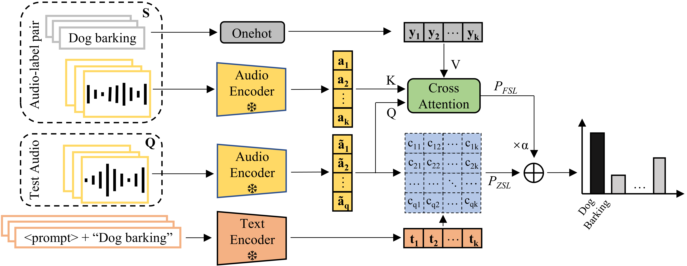

# Training-efficient (Treff) adapter for contrastive language-audio models

This is the official repo for the INTERSPEECH2023 paper "Adapting Language-Audio Models as Few-Shot Audio Learners". We proposed Treff adapter to boostrap language-audio pretraining model (such as CLAPs) with a few of labelled examples. It beats the zero-shot classifier and existing few-shot learning methods even WITHOUT training.

## Setup

You are required to just install the dependencies: `pip install -r requirements.txt` using Python 3 to get started.

## CLAP weights
Access CLAP weights: [Pretrained Model \[Zenodo\]](https://zenodo.org/record/7312125#.Y22vecvMIQ9)
Alternatively, you may also want to try out other version of CLAP model in [Pretrained Model](https://github.com/LAION-AI/).

## Usage

Please take a look at [scripts](https://github.com/JinhuaLiang/lam4fsl/tree/main/scripts) for usage examples. Ones may need to change the `WORK_DIR` and `STORAGE_DIR` to their custom direction. Also, to try out Treff adapter in more scenarios, one can directly adjust hyper-parameters, such as `MODEL_NAME` and `BATCH_SIZE`.

## Citation
To be released soon.

## Acknowledge
This repo is build upon the great jobs of [Microsoft CLAP](https://github.com/microsoft/CLAP) and [LAION CLAP](https://github.com/LAION-AI/CLAP).
